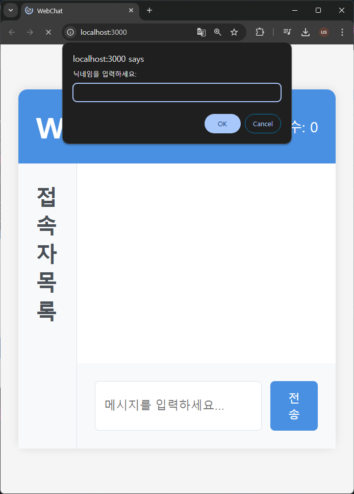
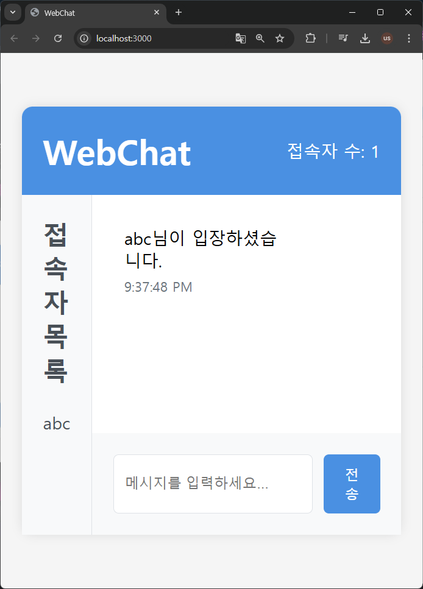

# OneRoomWebChat (Real-time Chat for One Room)

## 📝 Project Introduction
OneRoomWebChat is a chat application for real-time communication between landlords and tenants of one-room apartments. 
It supports efficient communication through intuitive UI and real-time message delivery.

## 🛠 Technologies Used
### Frontend
- HTML5
- CSS3
- JavaScript (ES6+)

### Backend
- Node.js
- Express.js
- Socket.IO (Real-time bidirectional communication)
- Eta (Template engine)

## ⚙ Key Features
- Real-time 1:1 Chat
- Intuitive UI/UX
- Emoji Support
- File Attachment
- Message Delivery Status
- Real-time Timestamp

## 🚀 Installation and Execution
```bash
# Clone repository
git clone https://github.com/yourusername/OneRoomWebChat.git

# Move to directory
cd OneRoomWebChat

# Install dependencies
npm install

# Run in development mode
npm run dev

# Run in production mode
npm start
```

## 💡 Project Structure
```
OneRoomWebChat/
├── public/          # Static files
├── server/          # Server-related files
├── views/           # Template files
├── app.js          # Main server file
├── index.html      # Main page
└── styles.css      # Stylesheet
```

## 🎯 Development Goals
1. Implementation of User-Friendly UI/UX
2. Optimization of Real-time Data Processing
3. Building a Stable Message Delivery System
4. Design of Scalable Architecture

## 📱 Screenshots



## 👨‍💻 Developer Information
- Name: Woobin Kim
- Email: louiswoobinkim0210@gmail.com
- GitHub: [@Ifus0210](https://github.com/Ifus0210)

## 📜 License
This project is under the MIT license.

